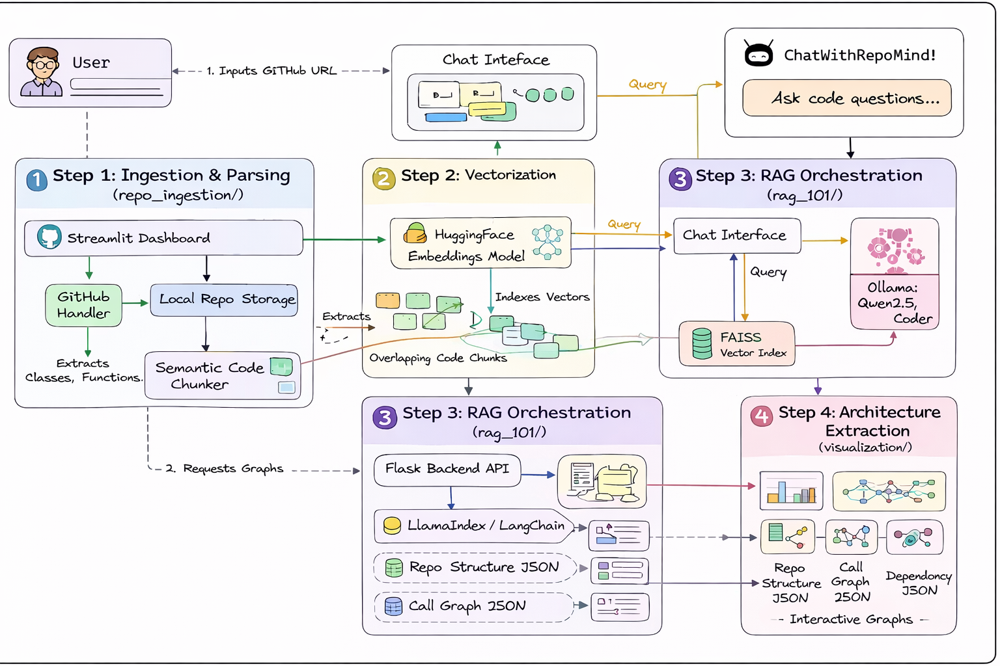

<div align="center">
  
  <h1>🧠 RepoMind Tracker</h1>
  <p><strong>A complete, context-aware AI coding assistant that helps you talk to, understand, and visualize your GitHub codebases.</strong></p>

  <p>
    <a href="#"></a>
    <a href="#"></a>
    <a href="#"></a>
    <a href="#"></a>
    <a href="#"></a>
  </p>

  <p>
    <em>Powered by Qwen 2.5 Coder, RAG (FAISS + LlamaIndex), and a Custom Node-Graph Pipeline.</em>
  </p>
</div>

<a id="top"></a>
---

## 📑 Table of Contents
1. [Overview](#overview)
2. [Features](#features)
3. [Under the Hood](#under-the-hood)
4. [Graphic Demonstrations](#graphic-demonstrations)
5. [Tech Stack](#tech-stack)
6. [Installation](#installation)
7. [Usage](#usage)
8. [API Documentation](#api-documentation)
9. [Project Structure](#project-structure)
10. [Contributing](#contributing)
11. [License](#license)

---

## 📖 Overview

### What problem it solves
Navigating and understanding a large, unfamiliar, or legacy GitHub codebase can take days. Developers struggle to figure out where functions are defined, how dependencies trace back globally, and what the overall architecture looks like before writing a single line of code.

### What the project does
RepoMind clones any public GitHub repository, parses the entire Abstract Syntax Tree (AST), and embeds the code into a semantic vector space using FAISS and HuggingFace models. You can then **chat directly with the code** and **generate graphical node-based visualizations** (Directory Structure, Dependencies, and Call Graphs) to instantly understand how the repository ticks.

### Who it is for
- **Software Engineers** joining a new project or onboarding to a massive microservice.
- **Code Reviewers** needing extra architectural context on large pull requests.
- **Open Source Contributors** trying to find the exact file to fix a bug in a multi-thousand-file repository.

---

## 🌟 Features

- ✨ **RAG-Powered Chat**: Ask questions about your code natively. The local LLM will scan your files and construct prompts grounded purely in your repository's logic.
- 🧠 **Conversational Memory**: Follow-up questions work! The bot remembers recent messages, allowing natural dialogue like *"Can you optimize the function you just explained?"*
- 🗺️ **Architecture Graphs**: Visualize your codebase instantly. Generating pure JSON endpoints that can be plugged into any frontend framework for:
  - Repository Directory Trees
  - Function Call Graphs (who calls whom across files)
  - Modular Dependency Tracking (import hierarchies)
- 🚀 **GPU Accelerated**: Built-in CUDA support via PyTorch to blaze through embedding massive codebases containing thousands of chunks.
- 🔒 **100% Local Privacy**: Runs entirely on your hardware via Ollama. No proprietary/enterprise code is ever sent to OpenAI, Anthropic, or external API providers.

---

## ⚙️ Under the Hood

When you submit a GitHub URL, RepoMind executes a highly optimized pipeline:
1. **Repository Ingestion:** Clones the repo locally to `cloned_repos/`.
2. **AST Parsing:** Uses Python's native AST module to break down files into logical components (Classes, Functions, Imports).
3. **Text Chunking:** Fragments the code into semantically coherent overlapping chunks.
4. **Vector Embedding:** Uses `BAAI/bge-large-en-v1.5` (via Langchain) to generate dense vector embeddings, leveraging GPU acceleration if available.
5. **FAISS Indexing:** Stores the vectors in a high-speed local index (`faiss_indices/`).
6. **LlamaIndex Query Engine:** Routes user queries through an Ollama-hosted LLM (`qwen2.5-coder:3b`) using the retrieved contexts.

---

## 🎨 Graphic Demonstrations

### 1. End-to-End Pipeline (RAG + code graphs)
> *An overview of how RepoMind ingests code, embeds chunks into FAISS, and answers questions grounded in retrieved context.*
> 
> 

<details>
  <summary>What happens in the pipeline?</summary>
  RepoMind:
  1. clones your GitHub repo into `cloned_repos/`
  2. extracts code chunks via traversal + chunking
  3. embeds chunks into a local FAISS index in `faiss_indices/`
  4. answers questions using Ollama + LlamaIndex, constrained by retrieved chunks
  5. generates graph data (structure/call/dependencies) for the UI
</details>

### 2. Visualizations inside the app
After you load a repository, open the `📊 Visualize` tab. You can generate:
<details>
  <summary>File Structure</summary>
  A hierarchical directory tree derived from your local clone.
</details>
<details>
  <summary>Call Graph</summary>
  A function-to-function graph showing how calls flow across files.
</details>
<details>
  <summary>Dependencies</summary>
  An import-based graph mapping file-level relationships.
</details>

---

## 🛠️ Tech Stack

**Language:** Python 3.10+

**Core Technologies:**
- **UI Frontend:** [Streamlit](https://streamlit.io/) (`app.py`)
- **Backend API:** [Flask](https://flask.palletsprojects.com/) (`visualization/api.py`)
- **Local LLM Engine:** [Ollama](https://ollama.com/) running *Qwen 2.5 Coder*
- **Vector Database:** [FAISS](https://faiss.ai/) (Facebook AI Similarity Search)
- **RAG Orchestration:** [LlamaIndex](https://www.llamaindex.ai/) & [Langchain](https://python.langchain.com/)
- **Embeddings Model:** `BAAI/bge-large-en-v1.5`
- **Acceleration:** PyTorch (CUDA 12.1+ Support)

---

## 🚀 Installation

### Prerequisites
1. [Python 3.10+](https://www.python.org/downloads/)
2. [Ollama](https://ollama.com/) (Must be installed and running as a background service)
3. **Git** (For cloning target repositories)

### Step-by-Step Setup

**1. Clone the repository**
```bash
git clone https://github.com/Yash-Kavaiya/RepoMind.git
cd RepoMind
```

**2. Create a Virtual Environment (Highly Recommended)**
```bash
python -m venv .venv

# On Windows (Command Prompt or PowerShell):
.venv\Scripts\activate

# On Mac/Linux:
source .venv/bin/activate
```

**3. Install Dependencies**

*For standard CPU environments:*
```bash
pip install -r requirements.txt
```

*🔥 For NVIDIA GPU Acceleration (Recommended for 10x faster indexing!):*
```bash
# Remove CPU-only torch versions
pip uninstall -y torch torchvision torchaudio

# Install PyTorch with CUDA 12.1 support
pip install torch torchvision torchaudio --index-url https://download.pytorch.org/whl/cu121
```
*(Verify GPU installation by running `python -c "import torch; print(torch.cuda.is_available())"`. It should print `True`.)*

**4. Start the Local LLM**
In a new terminal window (keep it running), pull and start the model:
```bash
ollama run qwen2.5-coder:3b
```

## ⏱️ Try it in ~2 minutes

1. Start the UI:
```bash
python -m streamlit run app.py
```
2. Open `http://localhost:8501` in your browser.
3. Paste a GitHub repo URL (for example: `https://github.com/pallets/flask`) into the sidebar and click **Load Repository**.
4. Ask a question like:
  <details>
    <summary>Sample prompts</summary>
    - `Where is the request routing logic located?`
    - `Explain the function that handles incoming requests.`
    - `Show the call graph for the main entry point.`
  </details>

---

## 💻 Usage

RepoMind consists of two parallel systems. You can run either the **Frontend UI** or the **Backend Visualization API** depending on your needs.

### Option A: The Streamlit Chat Application
To interact with the conversational AI, ingest repositories, and query code logic natively menus:

```bash
python -m streamlit run app.py
```
**Workflow:**
1. Open `http://localhost:8501` in your browser.
2. In the sidebar, paste a valid GitHub URL (e.g., `https://github.com/pallets/flask`).
3. Click **Load Repository** and wait for the ingestion process (FAISS indexing) to complete.
4. Use the Chat box to ask contextual questions: 
   - *"Where is the core routing logic located?"*
   - *"Explain the `render_template` function and optimize it."*

### Option B: The Application Visualization API (Flask)
If you want to extract raw architectural intelligence to build your own frontend UI (like React Flow or D3.js):

```bash
python -m visualization.api
```
The Flask server boots up natively on `http://localhost:5000`.

---

## 🔌 API Documentation

If running the Flask backend, you can execute `GET`/`POST` requests to retrieve codebase intelligence.

Base URL: `http://localhost:5000`

For repository-based endpoints, provide an absolute path via `repo_path`:
*(Replace `C:\path\to\repo` with the absolute path of the locally cloned repository stored in `cloned_repos/`.)*

| HTTP Method | Endpoint Path | Description | Response Type |
|--------|----------|-------------|-------------|
| `GET` | `/repo/structure?repo_path=<path>` | Generates a deep hierarchical tree dictionary of all project files and folders. | `application/json` |
| `GET` | `/repo/call-graph?repo_path=<path>` | Identifies functions and returns node/edge pairs detailing which functions call which. | `application/json` |
| `GET` | `/repo/dependencies?repo_path=<path>` | Analyzes Python `import` statements to map file-level dependencies. | `application/json` |
| `GET` | `/chat/history` | Retrieves the current session's chat memory array. | `application/json` |
| `POST` | `/chat/reset` | Purges conversation history memory for a fresh context window. | `application/json` |

<details>
  <summary>Run a quick API test (curl)</summary>
  ```bash
  curl "http://localhost:5000/repo/structure?repo_path=C:/path/to/cloned_repos/<repo_name>"
  ```
</details>

---

## 📂 Project Structure

```text
RepoMind/
├── app.py                      # Main Streamlit Chat Interface
├── architecture-diagram.png    # High-level pipeline illustration (shown in README)
├── cloned_repos/               # Local clones of target GitHub repos
├── faiss_indices/              # Persistent FAISS index storage
├── weights/                    # HuggingFace / embedding cache (created automatically)
├── rag_101/                    # LlamaIndex + retrieval orchestration
│   ├── client.py
│   ├── rag.py
│   └── retriever.py
├── repo_ingestion/             # Pipeline to clone, chunk, and embed code
│   ├── code_chunker.py
│   ├── embedding_store.py
│   ├── file_traversal.py
│   └── github_handler.py
├── visualization/              # AST parsing + graph generation + API
│   ├── api.py                  # Flask backend exposing JSON endpoints
│   ├── repo_structure.py      # Directory tree builder
│   ├── call_graph.py          # Function call graph builder
│   ├── dependency_graph.py   # Import dependency graph builder
│   ├── streamlit_viz.py       # Render helpers for Streamlit
│   └── ast_analyzers/         # Language-specific analyzers
├── memory/                     # Conversation memory
│   └── chat_memory.py
├── tests/                      # Automated tests
└── requirements.txt            # Python dependency locks
```

---

## 🛟 Troubleshooting

<details>
  <summary>Ollama errors (model not found / connection refused)</summary>
  Run `ollama run qwen2.5-coder:3b` first (in a separate terminal) and keep the service running.
</details>

<details>
  <summary>Ingestion takes a long time</summary>
  The first run includes cloning + chunking + embedding. Try a smaller repo to validate the setup, then scale up.
</details>

<details>
  <summary>API returns 400/404</summary>
  Double-check that `repo_path` is an existing absolute directory and that you’re using the correct parameter name: `repo_path` (not `path`).
</details>

<details>
  <summary>Windows curl quoting issues</summary>
  Use forward slashes in paths (for example `C:/Users/...`) and URL-encode spaces if needed.
</details>

---

## ❓ FAQ

<details>
  <summary>Is everything local / privacy-friendly?</summary>
  Yes. The Streamlit app calls Ollama locally; it does not require sending your code to OpenAI/Anthropic/etc.
</details>

<details>
  <summary>Does the API support multiple users?</summary>
  Currently the API uses a single global chat memory instance, so isolation per user/session is not implemented yet.
</details>

<details>
  <summary>Do FAISS indices get reused?</summary>
  The ingestion pipeline persists indices to `faiss_indices/`, but the current UI rebuilds during ingestion. (The project includes index-loading utilities for future reuse.)
</details>

---

## 🤝 Contributing

Contributions are what make the open-source community such an amazing place to learn, inspire, and create. Any contributions you make are **greatly appreciated**.

1. **Fork** the Project
2. **Create** your Feature Branch (`git checkout -b feature/AmazingFeature`)
3. **Commit** your Changes (`git commit -m 'Add some AmazingFeature'`)
4. **Push** to the Branch (`git push origin feature/AmazingFeature`)
5. **Open** a Pull Request

---

## 📄 License

Distributed under the MIT License. See the `LICENSE` file for more information.

<p align="right">(<a href="#top">back to top</a>)</p>
